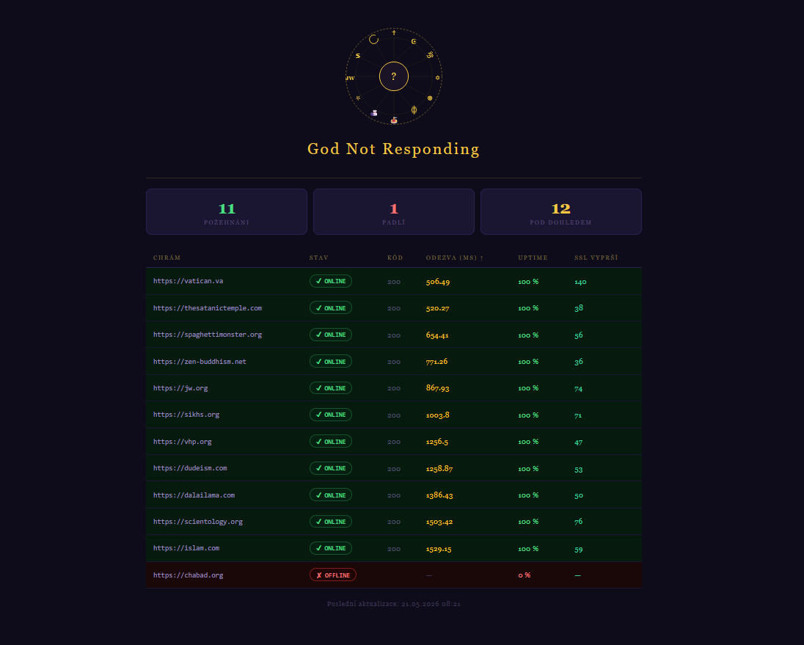

# god-not-responding

> Because even higher powers need 99.9% uptime

Monitoruje dostupnost webů 12 vybraných náboženství a duchovních směrů.
Pravidelně testuje každý web, měří odezvu, kontroluje SSL certifikát,
počítá velikost stránky a generuje HTML dashboard s výsledky.


## Instalace a spuštění

```bash
pip install -r requirements.txt
python main.py
```

## Sledované weby

| Web | Náboženství |
|-----|-------------|
| vatican.va | katolická církev |
| islam.com | islám |
| vhp.org | hinduismus |
| dalailama.com | buddhismus |
| zen-buddhism.net | zen buddhismus |
| chabad.org | judaismus |
| sikhs.org | sikhismus |
| scientology.org | scientologie |
| thesatanictemple.com | satanismus |
| jw.org | Svědkové Jehovovi |
| spaghettimonster.org | Církev létajícího špagetového monstra |
| dudeism.com | dudeismus |

## Co se sleduje

| Metrika | Popis |
|---------|-------|
| `is_online` | je server dostupný? |
| `status_code` | HTTP status kód |
| `response_time_ms` | rychlost odpovědi v ms |
| `ssl_valid` | platný HTTPS certifikát? |
| `ssl_expires_in_days` | za kolik dní vyprší SSL |
| `page_size_kb` | velikost stránky v kB |
| `checked_at` | čas kontroly |

## Výstupy

- `outputs/dashboard.html` — vizuální přehled všech služeb
- `outputs/history.csv` — historie všech měření
- `outputs/monitor.log` — log všech událostí

## Konfigurace

Weby ke sledování se nastavují v souboru `config.yaml`.
Stačí upravit seznam `endpoints` — každý web je jeden řádek s URL.

## Automatické spouštění

Na Windows lze projekt naplánovat přes Task Scheduler.
Nastavíš čas spuštění a systém spustí `python main.py` automaticky každý den.

## Požadavky

- Python 3.8+
- Viz `requirements.txt`
